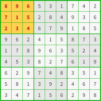
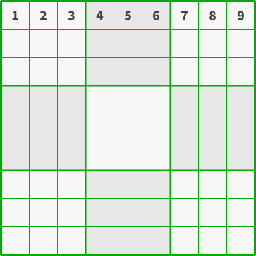

# Soduku and Formal Verification

## Challenge

In the last years I enjoyed using [nMigen](https://github.com/nmigen/nmigen), (an improved version of [Migen](https://github.com/m-labs/migen)), I like to explore the projects related to this framework, and in that quest I found some [excellent tutorial](https://github.com/RobertBaruch/nmigen-tutorial) and [graded exercises](https://github.com/RobertBaruch/nmigen-exercises) provided by @RobertBaruch.

These graded exercises focus on the formal verification capabilities of nMigen, so if you come from other tools/HDLs or already have experience with nMigen and have not tried it yet, I encourage you to learn formal verification concepts like [Bounded Model Check](https://en.wikipedia.org/wiki/Model_checking), or force your model to reach to some specific state and tell you how it did it, or prove some properties by induction.

After completing the exercises, there is a challenge to test what you have learned: you have to develop a [Sudoku solver](https://en.wikipedia.org/wiki/Sudoku_solving_algorithms).

## Sudoku rules

Sudoku rules are pretty easy to understand.

Sudoku board has 81 cells distributed in a 9 x 9 grid, if you take 9 horizontal neighbours cells it make a row, if you take 9 vertical neighbours cells you make a column, and if you subdivide the whole 9 x 9 grid into a new 3 x 3 grid with each new cell composed of 3 x 3 subcells you have nine zones.

|  |  |  |
|:--:| :--:| :--:|  
| *Representation of a row* | *Representation of a column* | *Representation of a zone* |

To properly complete a Sudoku game you need to fulfill the following rules:

Each cell must a digit in the range [1, 9], but only one.

Each row must contain all the digits of the range [1, 9], there are only 9 cells per row, so that means you can have only one digit of each.

Each column must contain all the digits of the range [1, 9].

Each zone must contain all the digits of the range [1, 9].

A Sudoku game has only one valid solution, the board start with some given clues (the minimum is 17) that hint you how to solve that game.

What make it interesting is to follow all these constraints and fill all the remaining cells of the board.

Note: What I call *zone* other people call *box*, *block*, *region* or a *square*.

## Sudoku solvers

I personally love to solve Sudoku puzzles and have expended some time doing it, also have programmed some solvers to exercise my computer science skills, there exists a lot of ways of do so: from mimic the human techniques, bruteforce, backtracking, constraint programming, [DLX](https://en.wikipedia.org/wiki/Dancing_Links), using solvers and a mix of all these techniques. 

Usually, backtracking mixed with constraint propagation and some human-like-solving techniques is what state of the art solvers use, which are capable of solve each board in [just](https://github.com/t-dillon/tdoku) [a few](https://github.com/dobrichev/fsss2) [micro-seconds](http://forum.enjoysudoku.com/3-77us-solver-2-8g-cpu-testcase-17sodoku-t30470-210.html#p249309), which is really impressive.

If you like play with solvers, Sudoku is a problem that fit perfectly with [SAT](https://en.wikipedia.org/wiki/Satisfiability_modulo_theories) and [SMT](https://en.wikipedia.org/wiki/Boolean_satisfiability_problem) solvers, and if you look at [some](https://github.com/taufanardi/sudoku-sat-solver/blob/master/Sudoku.py) [examples](https://github.com/vgurupra/Sudoku-Z3-Solver/blob/master/Sudoku_Z3.py), you will notice that you have to figure out how to express Sudoku mechanics using solver API primitives on your own.

In the solver spaces there are also declarative and optimization languages like *Prolog* and *AMPL*, they offer a very idiomatic way to express the constraints needed, so you could define the Sudoku rules in a very elegant and concise way with solutions that only need [15](http://programmablelife.blogspot.com/2012/07/adventures-in-declarative-programming.html) or [11](https://news.ycombinator.com/item?id=4328370) lines of code.

## Solve the Sudoku as a by-product of Sudoku validation

The *EDA* industry makes extended use of formal verification, you must pay attention to the correctness of your work, because you can't easily/cheaply "patch" an already taped-out design, it is extremely expensive to make new mask for an ASIC revision.

Luckily for all us, in the last decade we have experienced a proliferation of high quality open source EDA tools, among them is a synthesis framework named [Yosys](https://github.com/YosysHQ/yosys) that have the capability of perform formal verification steps, we can use it at pair with [SymbiYosys](https://github.com/YosysHQ/SymbiYosys), a frontend from the same authors to ease its usage at the formal verification flows.

Using the property checker capability of Yosys, and the nMigen ability to express the equivalent [SystemVerilog Assertions](https://www.systemverilog.io/sva-basics), we can **assume** the Sudoku clues and **cover** the case where the all the Sudoku rules meet.

### Accept the external input

We are going to tolerate a bunch of formats variations for a Sudoku boards.

For example, we want to accept the follow representations as valid ones:

* Example 1:

```
.36.5421821..387.474.9....31....7.323.7125..9..2.69.7.6214..9.7874.913.6593....81
```

* Example 2:

```
036 054 218 
210 038 704 
740 900 003

100 007 032
307 125 009
002 069 070 

621 400 907
874 091 306
593 000 081
```

* Example 3:

```
x36 x54 218 
21x x38 7x4 
74x 9xx xx3

1xx xx7 x32
3.7 125 xx9
xx2 x69 x7x 

621 4xx 9x7
874 x91 3x6
593 xxx x81
```

* Example 4:

```
.36|.54|218 
21.|.38|7.4 
74.|9..|..3
---+---+---
1..|..7|.32
3.7|125|..9
..2|.69|.7. 
---+---+---
621|4..|9.7
874|.91|3.6
593|...|.81
```

For that, we are going to ignore certain characters like `+ - |`, new line, spaces, tabs, etc, treat every digit between 1 and 9 as a given, and everything else as empty cell.

The following Python snippet will do the work:

```python
import sys, re

sudoku = list(
  map(int, re.sub("[^1-9]", "0", re.sub("\n|\r|\t| |\||-|\+", "", sys.argv[1])))
)

print([sudoku[i*9:i*9+9] for i in range(9)])
```

### Define our device

The first step for develop this solver is to define our device, it must accept a complete or incomplete Sudoku set and tell us if it meets the whole set of rules, in fact, the device is nothing more than a Sudoku checker (not a solver).

For that we need to create 81 inputs, each one named as *A1* to *I9* as in the grids described above, if we want to see them in the simulated waveforms we need to instantiate the variables as members of our class, to do it within Python in a dynamic form we can use the `__dict__` dictionary, but there is a catch: nMigen don't auto-recognize the name of the member when they are defined in a dynamic form, so you need to use the `name` attribute of `Signal()`. 

This code will do the job:

```python
# Inputs
for x in "ABCDEFGHI":
    for y in "123456789":
        self.__dict__[x + y] = Signal(range(1, 10), name=x + y)
```

|  |
|:--:|
| *A labeled Sudoku grid* |

Also we need to define the output signals of our device, in this case we want four signals:

* `rows`: are each of the nine rows correct, that means: is a valid permutation of *(1, 2, 3, 4, 5, 6, 7, 8, 9)* on each row?
* `cols`: are each of the nine cols correct, that means: is a valid permutation of *(1, 2, 3, 4, 5, 6, 7, 8, 9)* on each column?
* `zones`: are each of the nine zones correct, that means: is a valid permutation of *(1, 2, 3, 4, 5, 6, 7, 8, 9)* on each zone?
* `sudoku`: are all three previous conditions meet?

So, adding the outputs signals and some auxiliary members for signal translating, and keep input grouping, the constructor code results in the following: 

```python
class Sudoku(Elaboratable):
    def __init__(self):
        # Auxs
        self.idxs = []
        self.inputs = []

        # Inputs
        for x in "ABCDEFGHI":
            for y in "123456789":
                self.__dict__[x + y] = Signal(range(1, 10), name=x + y)
                self.__dict__["d" + x + y] = Signal(9, name="d" + x + y)
                self.idxs.append(x + y)
                self.inputs.append(self.__dict__[x + y])

        # Outputs
        self.rows = Signal()  # are the 9 rows correct?
        self.cols = Signal()  # are the 9 cols correct?
        self.zones = Signal()  # are the 9 zones correct?
        self.sudoku = Signal()  # are the rows, cols and zones correct?
```

### Elaborating our design

#### Rule 1: There must be only one digit per cell

For check the Sudoku constraint meeting we are going use standard bit operations, as we accept only one digit per cell, a 9 bits signal each one representing one of the possible cell values seem a good fit, and a **one hot** style of signal is perfectly suitable, so we are going to create a decoder:

```python
# one-hot decoder, 9 bits, starting from 1, not 0
def decoder(m, s, n):
    with m.Switch(n):
        for i in range(1, 10):
            with m.Case(i):
                m.d.comb += s.eq(1 << (i - 1))
        with m.Default():
            m.d.comb += s.eq(0)  # If no case matches
```

I am aware that nMigen has is own decoder available, but we want to use just 9 bits, using a standard one hot decoder in this case would generate a 10 bits signal and as we don't need to include the zero value, we have to create our own version.

Now we can create a decoded version of each cell, so for the cell named *A1*, we got a decoded cell member named *dA1*, and so on:

```python
# one one-hot decoder from each cell
for i, v in enumerate(self.idxs):
    decoder(m, self.__dict__["d" + v], self.__dict__[v])
```

As our input data is the binary representation of a number, we are sure that digit superposition in the same cell is impossible, one hot properties assure this furthermore, but we also have the possibility of have an empty cell, so why would have an empty cell if this is a checker? Don't we need the whole board filled before check it? **... of course for checking it is the case, not for solving ;)**

### Rule 2: There must distinct digits in each rows cells

At this moment we have a 9 bit signal for each row with a bit set representing each Sudoku possible digit.

Now we need to check that only one instance of each digit is present in a row, for do this easily we can `or` each row's cells, so first we are going to define each of the 9 rows [`rA` .. `rI`] as follow:

```python
        grid = (
            ("rA", ("A1", "A2", "A3", "A4", "A5", "A6", "A7", "A8", "A9")),
            ("rB", ("B1", "B2", "B3", "B4", "B5", "B6", "B7", "B8", "B9")),
            ("rC", ("C1", "C2", "C3", "C4", "C5", "C6", "C7", "C8", "C9")),
            ("rD", ("D1", "D2", "D3", "D4", "D5", "D6", "D7", "D8", "D9")),
            ("rE", ("E1", "E2", "E3", "E4", "E5", "E6", "E7", "E8", "E9")),
            ("rF", ("F1", "F2", "F3", "F4", "F5", "F6", "F7", "F8", "F9")),
            ("rG", ("G1", "G2", "G3", "G4", "G5", "G6", "G7", "G8", "G9")),
            ("rH", ("H1", "H2", "H3", "H4", "H5", "H6", "H7", "H8", "H9")),
            ("rI", ("I1", "I2", "I3", "I4", "I5", "I6", "I7", "I8", "I9")),
...
```

The structure above is a collection of tuples with the name of the row in addition of a tuple with name of the cells that makes such row.

So using nMigen assignments we can make an `or` construct with each cell decoded value:

```python
        for v in grid:
            name = v[0]
            cells = v[1]
            cond = self.__dict__["d" + cells[0]]
            for c in cells[1:]:
                cond |= self.__dict__["d" + c]
            self.__dict__[name] = Signal(9, name=name)
            # print("cond"+name, cond)
            m.d.comb += self.__dict__[name].eq(cond)
```

Now we have a 9 bits Signal with each bit representing the existence of each digit, so we can check each of them (or alternatively `and` them) for the expected **0b111_111_111** value and assign it to the respective output `Signal`:

```python
        m.d.comb += self.rows.eq(
            (self.rA == 0b111_111_111) & (self.rB == 0b111_111_111) & (self.rC == 0b111_111_111)
            & (self.rD == 0b111_111_111) & (self.rE == 0b111_111_111) & (self.rF == 0b111_111_111)
            & (self.rG == 0b111_111_111) & (self.rH == 0b111_111_111) & (self.rI == 0b111_111_111)
        )
```

### Rule 3: There must distinct digits in each columns cells

At this moment, the Sudoku check procedure start turning repetitive, the same that we do with row we are going to do with columns, we have the columns definitions:

```python
        grid = (
            ("rA", ("A1", "A2", "A3", "A4", "A5", "A6", "A7", "A8", "A9")),
...
            ("c1", ("A1", "B1", "C1", "D1", "E1", "F1", "G1", "H1", "I1")),
            ("c2", ("A2", "B2", "C2", "D2", "E2", "F2", "G2", "H2", "I2")),
            ("c3", ("A3", "B3", "C3", "D3", "E3", "F3", "G3", "H3", "I3")),
            ("c4", ("A4", "B4", "C4", "D4", "E4", "F4", "G4", "H4", "I4")),
            ("c5", ("A5", "B5", "C5", "D5", "E5", "F5", "G5", "H5", "I5")),
            ("c6", ("A6", "B6", "C6", "D6", "E6", "F6", "G6", "H6", "I6")),
            ("c7", ("A7", "B7", "C7", "D7", "E7", "F7", "G7", "H7", "I7")),
            ("c8", ("A8", "B8", "C8", "D8", "E8", "F8", "G8", "H8", "I8")),
            ("c9", ("A9", "B9", "C9", "D9", "E9", "F9", "G9", "H9", "I9")),
...
```

And with each *one hot* decoded and `or`ed cells moved to a 9 bits `Signal` is time to check that each column meets the criteria of having one instance of each digit, and with this we set the *columns valid* `cols` output `Signal` properly.

```python
        m.d.comb += self.cols.eq(
            (self.c1 == 0b111_111_111) & (self.c2 == 0b111_111_111) & (self.c3 == 0b111_111_111)
            & (self.c4 == 0b111_111_111) & (self.c5 == 0b111_111_111) & (self.c6 == 0b111_111_111)
            & (self.c7 == 0b111_111_111) & (self.c8 == 0b111_111_111) & (self.c9 == 0b111_111_111)
        )
```

### Rule 4: There must distinct digits in each zones cells

This is exactly the same that we did with columns, but now with zones, so we now take care of the *z*s in the `grid` definition:

```python
        grid = (
...
            ("z1", ("A1", "A2", "A3", "B1", "B2", "B3", "C1", "C2", "C3")),
            ("z2", ("A4", "A5", "A6", "B4", "B5", "B6", "C4", "C5", "C6")),
            ("z3", ("A7", "A8", "A9", "B7", "B8", "B9", "C7", "C8", "C9")),
            ("z4", ("D1", "D2", "D3", "E1", "E2", "E3", "F1", "F2", "F3")),
            ("z5", ("D4", "D5", "D6", "E4", "E5", "E6", "F4", "F5", "F6")),
            ("z6", ("D7", "D8", "D9", "E7", "E8", "E9", "F7", "F8", "F9")),
            ("z7", ("G1", "G2", "G3", "H1", "H2", "H3", "I1", "I2", "I3")),
            ("z8", ("G4", "G5", "G6", "H4", "H5", "H6", "I4", "I5", "I6")),
            ("z9", ("G7", "G8", "G9", "H7", "H8", "H9", "I7", "I8", "I9")),
        )

```

And repeat the same checking step than we did with rows and columns before:

```python
        m.d.comb += self.zones.eq(
            (self.z1 == 0b111_111_111) & (self.z2 == 0b111_111_111) & (self.z3 == 0b111_111_111)
            & (self.z4 == 0b111_111_111) & (self.z5 == 0b111_111_111) & (self.z6 == 0b111_111_111)
            & (self.z7 == 0b111_111_111) & (self.z8 == 0b111_111_111) & (self.z9 == 0b111_111_111)
        )
```

### Putting all together

Now that we have done with the cols, rows and zones `Singal`s, we just need the ultimate `sudoku` output `Signal` that tell us if the whole Sudoku is valid.


```python
        m.d.comb += self.sudoku.eq(self.cols & self.rows & self.zones)
```

And that is! We have now a 100% combinational logic Sudoku checker that is synthesizable, that is interesting because you can check a Sudoku board without any involved sequential process, just sets the inputs to the device and it will return whether is valid or not in almost no time at the output.

### Simulation

At this stage we are ready to simulate our device and test some cases, for this we are going to:
* Instantiate a device.
* Instantiate a Simulator (*pysim* by default).
* Define a `process` for define stimuli, that:
  * Wait 1 nanosecond.
  * For each cell, if there exist an input value (it comes in `userdata`) it sets this cell with such value, otherwise do nothing.
  * Wait for combinational logic to `Settle`.
  * Wait 1 nanosecond.
* Add those stimuli to the simulation.
* Run the simulation generate in a waveform file in the [GTKWave](http://gtkwave.sourceforge.net/) format.

The code is as follows:

```python
    @classmethod
    def sim(cls, userdata=None):
        s = cls()
        sim = Simulator(s)

        def process():
            yield Delay(1e-9)
            for i, v in enumerate(s.idxs):
                if userdata[i] >= 1 and userdata[i] <= 9:
                    yield s.__dict__[v].eq(userdata[i])
            yield Settle()
            yield Delay(1e-9)

        sim.add_process(process)
        with sim.write_vcd("sudoku.vcd", "sudoku.gtkw"):
            sim.run()
```
Let's simulate it with the following test case:

|  |
|:--:|
| *Test case for simulation* |

Note: from now on, the syntax to call our code will be `python3 sudoku.py <sim|gen> <sudoku set>`

```bash
python3 sudoku.py sim "123456789000000000000000000000000000000000000000000000000000000000000000000000000"
```

And then explore the resulting waveform file with:

```bash
gtkwave sudoku.gtkw 
```

|  |
|:--:|
| *GTKWave screenshot of simulation with the relevant waveforms selected* |

It show each of the inputs [`A1`, `A9`] with values of [1, 9] respectively, the internal `Signal`s [`dA1`, `dA9`] with the values:

| hex  | bin |
| :--: | :--: |
| 001h | 000_000_001b |
| 002h | 000_000_010b |
| 004h | 000_000_100b |
| 008h | 000_001_000b |
| 010h | 000_010_000b |
| 020h | 000_100_000b |
| 040h | 001_000_000b |
| 080h | 010_000_000b |
| 100h | 100_000_000b |

That correspond to the one hot decoded version of [`A1`, `A9`]

And the internal `Signal` `rA` with 1FFh (111_111_111b), which means that the first row meets the validations.

However the `rows`, `cols`, `zones` and `sudoku` `Signal`s are not asserted, and that is fine because we have only one row correct.

Now we can test this other test case:

|  |
|:--:|
| *Test case for simulation* |

```bash
python3 sudoku.py sim "123456789234567891345678912456789123567891234678912345789123456891234567912345678"
```

And if we add other relevant `Signal`s to the displayed waves (ie: the first column data), we could see:

|  |
|:--:|
| *GTKWave screenshot of simulation with the relevant waveforms selected* |

In addition to the `Signal`s shown in the previous test case, this one shows `Signal`s [`A1`, `I1`] and the correspondent one hot decoded [`dA1`, `dI1`]. 

Notice that now the `rows` and `cols` output `Signal`s are asserted because **ALL** rows and cols are valid.

As an exercise for the reader I let you this test case:

|  |
|:--:|
| *Test case for simulation* |

### Make a solver

We are almost done with this challenge, now comes the formal part which is very easy for this kind of problems, we have already a working Sudoku checker.

The first step is to check if there exists a sequence of inputs that produce satisfaction to a solved board, that means we are going to ask the solver to give us the correct inputs that produce an asserted `sudoku` `Signal`.

For that we need to:
* Instantiate our device (the class is the `cls` parameter here).
* Express the case we want to `Cover`.
* Return the module, and the inputs `Signal`s to test with.

```python
    @classmethod
    def formal(cls, userdata=None) -> Tuple[Module, List[Signal]]:
        m = Module()
        m.submodules.s = s = cls()

        m.d.comb += Cover(s.sudoku)

        return m, s.inputs
```

We now have to create a Symbiyosys `sby` configuration file:

```
[tasks]
cover

[options]
cover: mode cover

[engines]
cover: smtbmc z3

[script]
read_ilang sudoku.il
prep -top top

[files]
sudoku.il
```

In a Simbiyosys configuration file:

* The `task` section describes a series of processing tasks, for this example we need just one task, we are going to name it **cover**.

* The `options` section defines the mode that we are going to use, Symbiyosys supports: `bmc`, `prove`, `live`, `cover`, `equiv` and `synth` [modes](https://readthedocs.org/projects/symbiyosys/downloads/pdf/latest/).

* The `engines` section configure an engine to be used for our task, there are different engines for different needs, also in this case, pass the SMT2 solver to be use and its parameters.

* The `script` section contains the Yosys script that reads and elaborates the design under test.

* The `files` section list the files that will be available to Yosys.

Now is time to execute the tool:

```
victor@cadeb4843ab1:~/formal/sudoku-challenge$ sby -f sudoku.sby 
SBY 13:46:32 [sudoku_cover] Removing directory 'sudoku_cover'.
SBY 13:46:32 [sudoku_cover] Copy 'sudoku.il' to 'sudoku_cover/src/sudoku.il'.
SBY 13:46:32 [sudoku_cover] engine_0: smtbmc z3
SBY 13:46:32 [sudoku_cover] base: starting process "cd sudoku_cover/src; yosys -ql ../model/design.log ../model/design.ys"
SBY 13:46:32 [sudoku_cover] base: finished (returncode=0)
SBY 13:46:32 [sudoku_cover] smt2: starting process "cd sudoku_cover/model; yosys -ql design_smt2.log design_smt2.ys"
SBY 13:46:32 [sudoku_cover] smt2: finished (returncode=0)
SBY 13:46:32 [sudoku_cover] engine_0: starting process "cd sudoku_cover; yosys-smtbmc -s z3 --presat -c --noprogress -t 20  --append 0 --dump-vcd engine_0/trace%.vcd --dump-vlogtb engine_0/trace%_tb.v --dump-smtc engine_0/trace%.smtc model/design_smt2.smt2"
SBY 13:46:32 [sudoku_cover] engine_0: ##   0:00:00  Solver: z3
SBY 13:46:32 [sudoku_cover] engine_0: ##   0:00:00  Checking cover reachability in step 0..
SBY 13:46:58 [sudoku_cover] engine_0: ##   0:00:25  Reached cover statement at sudoku.py:121 in step 0.
SBY 13:46:58 [sudoku_cover] engine_0: ##   0:00:25  Writing trace to VCD file: engine_0/trace0.vcd
SBY 13:46:58 [sudoku_cover] engine_0: ##   0:00:25  Writing trace to Verilog testbench: engine_0/trace0_tb.v
SBY 13:46:58 [sudoku_cover] engine_0: ##   0:00:25  Writing trace to constraints file: engine_0/trace0.smtc
SBY 13:46:58 [sudoku_cover] engine_0: ##   0:00:25  Status: passed
SBY 13:46:58 [sudoku_cover] engine_0: finished (returncode=0)
SBY 13:46:58 [sudoku_cover] engine_0: Status returned by engine: pass
SBY 13:46:58 [sudoku_cover] summary: Elapsed clock time [H:MM:SS (secs)]: 0:00:26 (26)
SBY 13:46:58 [sudoku_cover] summary: Elapsed process time [H:MM:SS (secs)]: 0:00:26 (26)
SBY 13:46:58 [sudoku_cover] summary: engine_0 (smtbmc z3) returned pass
SBY 13:46:58 [sudoku_cover] summary: trace: sudoku_cover/engine_0/trace0.vcd
SBY 13:46:58 [sudoku_cover] DONE (PASS, rc=0)
victor@cadeb4843ab1:~/formal/sudoku-challenge$ 

```

It took 26 seconds to found the first case that satisfies our cover case, and generate the traces that produce it, we can see the file `engine_0/trace0.vcd` with GTKWave:

|  |
|:--:|
| *First valid generated inputs waveforms* |

So it is a random valid board, we can render it as a Sudoku to check it ourselves:

|  |
|:--:|
| *Valid generated board* |

Notice that there are **really** lot ([in fact 6,670,903,752,021,072,936,960](https://en.wikipedia.org/wiki/Mathematics_of_Sudoku#Enumerating_Sudoku_solutions)) of valid Sudoku boards, but the solver stopped when it found the first one.

If you are not satisfied with this result you can force the random seed used by the Z3 solver changing this snippet of the SymbiYosys configuration file:

```
[engines]
cover: smtbmc z3 smt.random_seed=56789
```

OK, so we have a Sudoku checker, Sudoku board generator but not a solver yet.

For complete our goal we need to provide a given incomplete board to our solver, an we will do it in a similar way than in simulation, but this time we are declaring to the tool that we `Assume` that certain cells have already a value, and it have to be compatible with our former cover statement:

```python
    @classmethod
    def formal(cls, userdata=None) -> Tuple[Module, List[Signal]]:
        m = Module()
        m.submodules.s = s = cls()

        for i, v in enumerate(s.idxs):
            if userdata[i] >= 1 and userdata[i] <= 9:
                m.d.comb += Assume(s.__dict__[v] == userdata[i])

        m.d.comb += Cover(s.sudoku)

        return m, s.inputs
```

This time we are going to use this Sudoku game:

|  |
|:--:|
| *Given board* |

So we generate the *Yosys ilang* file with this:

```python
python3 sudoku.py gen "..65.17...1..84..6...6.9...9.2.158.........244......1.629.......8.....67.4....29."
```

And let's run the tool:

```
victor@cadeb4843ab1:~/formal/sudoku-challenge$ sby -f sudoku.sby 
SBY 15:21:33 [sudoku_cover] Removing directory 'sudoku_cover'.
SBY 15:21:33 [sudoku_cover] Copy 'sudoku.il' to 'sudoku_cover/src/sudoku.il'.
SBY 15:21:33 [sudoku_cover] engine_0: smtbmc z3
SBY 15:21:33 [sudoku_cover] base: starting process "cd sudoku_cover/src; yosys -ql ../model/design.log ../model/design.ys"
SBY 15:21:33 [sudoku_cover] base: finished (returncode=0)
SBY 15:21:33 [sudoku_cover] smt2: starting process "cd sudoku_cover/model; yosys -ql design_smt2.log design_smt2.ys"
SBY 15:21:34 [sudoku_cover] smt2: finished (returncode=0)
SBY 15:21:34 [sudoku_cover] engine_0: starting process "cd sudoku_cover; yosys-smtbmc -s z3 --presat -c --noprogress -t 20  --append 0 --dump-vcd engine_0/trace%.vcd --dump-vlogtb engine_0/trace%_tb.v --dump-smtc engine_0/trace%.smtc model/design_smt2.smt2"
SBY 15:21:34 [sudoku_cover] engine_0: ##   0:00:00  Solver: z3
SBY 15:21:34 [sudoku_cover] engine_0: ##   0:00:00  Checking cover reachability in step 0..
SBY 15:21:35 [sudoku_cover] engine_0: ##   0:00:00  Reached cover statement at sudoku.py:121 in step 0.
SBY 15:21:35 [sudoku_cover] engine_0: ##   0:00:00  Writing trace to VCD file: engine_0/trace0.vcd
SBY 15:21:35 [sudoku_cover] engine_0: ##   0:00:00  Writing trace to Verilog testbench: engine_0/trace0_tb.v
SBY 15:21:35 [sudoku_cover] engine_0: ##   0:00:01  Writing trace to constraints file: engine_0/trace0.smtc
SBY 15:21:35 [sudoku_cover] engine_0: ##   0:00:01  Status: passed
SBY 15:21:35 [sudoku_cover] engine_0: finished (returncode=0)
SBY 15:21:35 [sudoku_cover] engine_0: Status returned by engine: pass
SBY 15:21:35 [sudoku_cover] summary: Elapsed clock time [H:MM:SS (secs)]: 0:00:02 (2)
SBY 15:21:35 [sudoku_cover] summary: Elapsed process time [H:MM:SS (secs)]: 0:00:01 (1)
SBY 15:21:35 [sudoku_cover] summary: engine_0 (smtbmc z3) returned pass
SBY 15:21:35 [sudoku_cover] summary: trace: sudoku_cover/engine_0/trace0.vcd
SBY 15:21:35 [sudoku_cover] DONE (PASS, rc=0)
victor@cadeb4843ab1:~/formal/sudoku-challenge$ 
```

This time it took just 2 seconds instead of 26, and the traces provide the remaining correct cells values:

|  |
|:--:|
| *Formal solved board* |

## Conclusion

Formal verification is a really undervalued tool in the software development lifecycle. On the other hand, in the EDA industry it have is own niche.

You can use it for verify properties in your code, check if two pieces of code/hardware are equivalent, check if your protocol or distributed system is correct and safe, of course it will perform as good as the person that define the checks, it is not a magic bullet.

As for solving a Sudoku, this exercise and leverage on formal verification is not its best use, as mentioned earlier there exists better tools like direct solve it in a SMT solver, use Prolog, AMPL, etc, and there are better options for performance like using the already mentioned *ad hoc* Sudoku solvers.

The idea of this if start grasping on a full Open Source tool like Yosys/Simbiyosys and learn the basics and the potential of formal verification.

I hope that formal verification usage expand to areas like software correctness and bug prevention, as it seems like it is still stuck in the EDA industry, smart contract research and academic research.
